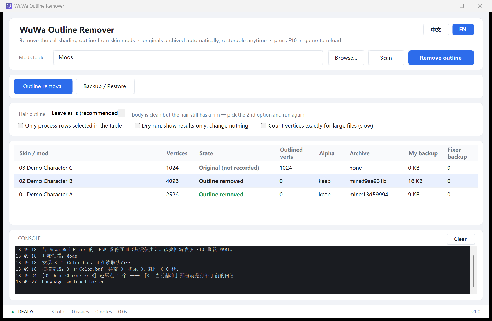

# Wuwa Outline Remover

[中文](README.md) | **English**

[](LICENSE)
[](#build)
[](#safety)

Removes the cartoon outline from WWMI (3DMigoto) skin mods on Windows.
Single-file exe, no dependencies, no network, no injection — and every change is one click away from being undone.



## Quick start

1. Download `WuwaOutlineTool.exe` and double-click it (no install, no admin rights)
2. Pick `…\XXMI\WWMI\Mods` → **Scan** → review → **Remove outline**
3. Press **F10** in game to reload WWMI

* Dry run first: tick "Dry run: show results only, change nothing"
* Try it without touching your own mods: `.\tools\make-demo.ps1 -Out D:\demo-mods`, then `.\WuwaOutlineTool.exe --scan D:\demo-mods`

## How it works

Outline thickness lives in each mod's own `Meshes\Color.buf` (4 bytes per vertex):

| Channel | Meaning | This tool |
|---|---|---|
| R | Outline Mask | set to 0 |
| G | Outline Thickness | set to 0 |
| B | Skin Mask | **never touched** |
| A | Hair outline | kept by default, optional flag |

Patching by data means it is independent of character, shader hash and game version.
Only characters that use a mod are affected; vanilla outlines come from the game's own shaders.

## Safety

The original file and a manifest are archived **inside each mod's own `Meshes` folder** before any change
(renaming or moving the mod never loses them), and restore is byte-exact. Re-running is idempotent,
channel B is never written, Wuwa Mod Fixer backups are read-only, and only `Meshes\Color.buf` is touched.
No injection, no game memory, no game files, no network. See [SECURITY.md](SECURITY.md).

Verify it yourself (offline, on a sandbox copy, never touching your game folder):

```powershell
.\tools\wuwa-test.ps1            # 15 checks: R/G zeroed, B/A untouched, restore SHA1-exact, idempotent
.\tools\wuwa-snapshot.ps1        # independent snapshot you can roll back to
.\WuwaOutlineTool.exe --selftest # 19 core-logic checks
```

## Backup & restore

Inside each mod's `Meshes`: `.nooutline.json` (manifest) + `Color.buf.orig.<hash>.bak` (original file).
The Backup / Restore tab lists every restorable version of the selected mod.


## Command line

```
WuwaOutlineTool.exe --cli -Path "<dir>"            patch
WuwaOutlineTool.exe --cli -Path "<dir>" -Alpha 0   also remove the hair outline
WuwaOutlineTool.exe --cli -Path "<dir>" -Status    status (read-only)
WuwaOutlineTool.exe --cli -Path "<dir>" -Verify    health check (read-only)
WuwaOutlineTool.exe --cli -Path "<dir>" -History   restore points (read-only)
WuwaOutlineTool.exe --cli -Path "<dir>" -Restore   restore to pre-patch state
WuwaOutlineTool.exe --cli -Path "<dir>" -Clean     delete this tool's archive + manifest
WuwaOutlineTool.exe --cli -Path "<dir>" -PurgeOrphans
WuwaOutlineTool.exe --cli -Path "<dir>" -DryRun    show only, write nothing
WuwaOutlineTool.exe --selftest                     self-test
WuwaOutlineTool.exe --scan "<dir>"                 open the GUI and scan
```

Add `-Lang en` for English output.

## Chinese / English

The `中文 / EN` pills in the top-right switch the UI; the choice is kept in `settings.json`.
Translations live in `i18n\lang.en.tsv` — edit in Notepad, then run `build.ps1`.

## Build

Only the .NET Framework compiler shipped with Windows is needed — no SDK, no NuGet, no network:

```powershell
.\build.ps1     # produces WuwaOutlineTool.exe in the repo root
```

```
src\     WuwaOutlineTool.cs (core + CLI) · Ui.cs (WinForms) · Lang.cs · LangData.cs (generated)
assets\  app.ico · app.manifest · icon-source.png (drawn in code by tools\make-icon.ps1)
i18n\    lang.en.tsv    tools\  build & verification scripts    docs\  test plan, screenshots
```

## FAQ

* **No visible effect** → press F10 to reload; vanilla characters are unaffected; texture-only mods are skipped
  by design (the tool flags them instead of writing)
* **Hair still has a rim** → set Alpha to "Remove hair outline (A=0)"
* **Will this get me banned?** → no injection, no memory reads, no game files, no network; it only edits mod files
  on your disk. Modding risks are yours to judge
* **Can I restore after deleting the backups?** → no; `-Verify` flags files with missing records in advance

More detail: [docs/TESTING.md](docs/TESTING.md).

## License

[MIT](LICENSE) © 2026 zuobolanblue-hash · Unofficial tool, not affiliated with Kuro Games, no game assets included.
