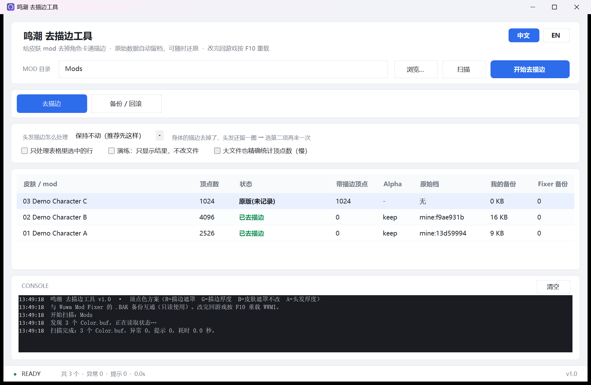
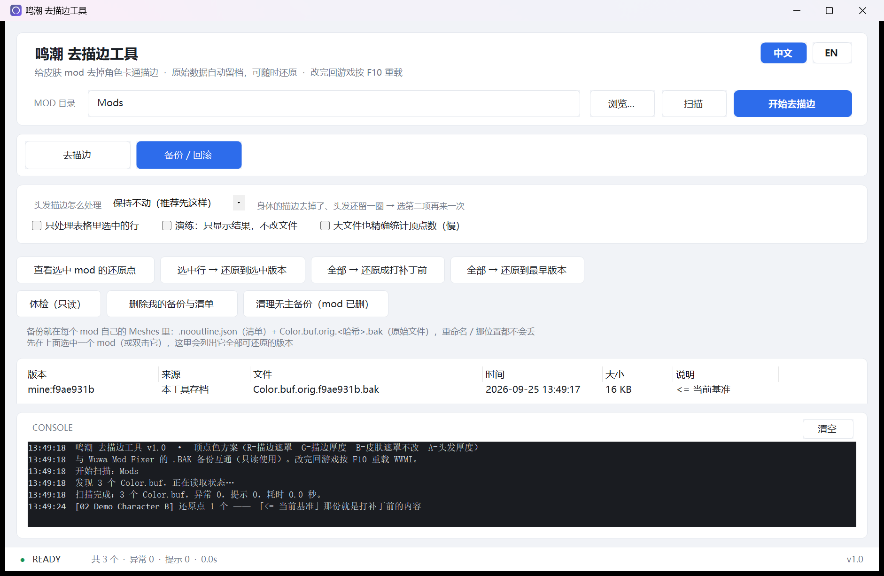

# 鸣潮 去描边工具 · Wuwa Outline Remover

**中文** | [English](README.en.md)

[](LICENSE)
[](#编译)
[](#安全)

给 WWMI（3DMigoto）皮肤 mod 去掉角色卡通描边的 Windows 小工具。单文件 exe、零依赖、不联网、不注入，改完随时一键还原。



## 快速开始

1. 下载 `WuwaOutlineTool.exe` 双击打开（免安装、免管理员权限）
2. 选 `…\XXMI\WWMI\Mods` → **扫描** → 确认列表 → **开始去描边**
3. 回游戏按 **F10** 重载 WWMI

* 先空跑：勾「演练：只显示结果，不改文件」
* 不想碰自己的 mod 先试：`.\tools\make-demo.ps1 -Out D:\demo-mods`，再 `.\WuwaOutlineTool.exe --scan D:\demo-mods`

## 原理

描边粗细写在 mod 自己的 `Meshes\Color.buf` 里（每顶点 4 字节）：

| 通道 | 含义 | 本工具 |
|---|---|---|
| R | 描边遮罩 | 置 0 |
| G | 描边粗细 | 置 0 |
| B | 皮肤遮罩 | **不动** |
| A | 头发描边 | 默认保留，可用参数改 |

按数据改 ⇒ 与角色、shader hash、游戏版本无关，出新角色不用适配。
仅对装了 mod 的角色生效；原版角色的描边来自游戏本体 shader。

## 安全

改动前必留原始档 + 清单（放在每个 mod 自己的 `Meshes` 里，重命名 / 挪位置都不丢），可逐字节还原；
重复运行幂等、绝不改 B 通道、兼容 Wuwa Mod Fixer、只处理 `Meshes\Color.buf`。
不注入、不读游戏内存、不改游戏本体、不联网。细节见 [SECURITY.md](SECURITY.md)。

自己验（不碰游戏目录，沙盒副本上逐字节比对）：

```powershell
.\tools\wuwa-test.ps1            # 15 项：R/G 归零、B/A 未动、还原 SHA1 一致、幂等
.\tools\wuwa-snapshot.ps1        # 独立兜底快照，可整体回滚
.\WuwaOutlineTool.exe --selftest # 核心逻辑自检 19 项
```

## 备份与还原

每个 mod 的 `Meshes` 里：`.nooutline.json`（清单）+ `Color.buf.orig.<哈希>.bak`（原始文件）。
「备份 / 回滚」页会列出它的全部可还原版本。



## 命令行

```
WuwaOutlineTool.exe --cli -Path "<目录>"            去描边
WuwaOutlineTool.exe --cli -Path "<目录>" -Alpha 0   头发那圈也去掉
WuwaOutlineTool.exe --cli -Path "<目录>" -Status    看状态（只读）
WuwaOutlineTool.exe --cli -Path "<目录>" -Verify    体检（只读）
WuwaOutlineTool.exe --cli -Path "<目录>" -History   看还原点（只读）
WuwaOutlineTool.exe --cli -Path "<目录>" -Restore   还原到打补丁前
WuwaOutlineTool.exe --cli -Path "<目录>" -Clean     删掉本工具的存档与清单
WuwaOutlineTool.exe --cli -Path "<目录>" -PurgeOrphans
WuwaOutlineTool.exe --cli -Path "<目录>" -DryRun    只演练，不写盘
WuwaOutlineTool.exe --selftest                      自检
WuwaOutlineTool.exe --scan "<目录>"                 开界面并直接开扫
```

`-Lang en` 换英文输出。PowerShell 里收集输出请用管道（`... | Out-File r.txt -Encoding utf8`）。

## 中英文切换

界面右上角 `中文 / EN`，选择记在 `settings.json`。翻译表在 `i18n\lang.en.tsv`，记事本改完跑一次 `build.ps1` 即可。

## 编译

只需 Windows 自带的 .NET Framework 编译器，无需 SDK / NuGet / 联网：

```powershell
.\build.ps1     # 产物：根目录 WuwaOutlineTool.exe
```

```
src\     WuwaOutlineTool.cs（核心+CLI）· Ui.cs（界面）· Lang.cs · LangData.cs（自动生成）
assets\  app.ico · app.manifest · icon-source.png（图标由 tools\make-icon.ps1 用代码绘制）
i18n\    lang.en.tsv    tools\  构建与验证脚本    docs\  测试方案与截图
```

## 常见问题

* **改完没效果** → 按 F10 重载；原版角色不受影响；「只换贴图」型 mod 改了无效（工具会标出来并跳过，不写盘）
* **头发还留一圈** → Alpha 选「去掉头发描边（A=0）」
* **会封号吗** → 不注入、不读内存、不改游戏文件、不联网，只改磁盘上的 mod 文件；mod 本身的风险请自行评估
* **删了备份还能还原吗** → 不能，`-Verify` 会提前标出缺记录的文件

更多测试细节见 [docs/TESTING.md](docs/TESTING.md)。

## 许可

[MIT](LICENSE) © 2026 zuobolanblue-hash · 非官方工具，与库洛游戏无关，仓库内不含任何游戏素材。
